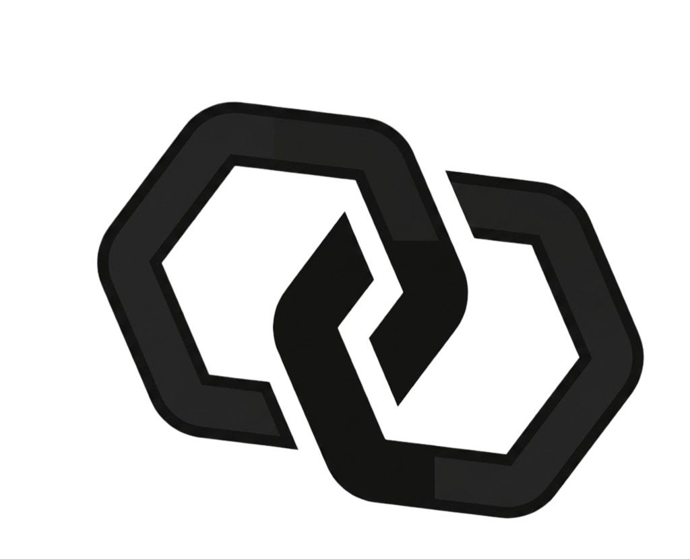

<p align="center">
  
</p>

<h1 align="center">loom</h1>
<p align="center"><strong>Your CLI coding agents, one office.</strong></p>

<p align="center">
  <a href="./README.ko.md"><b>한국어</b></a> ·
  <a href="./docs/V2-PLAN.md">Design notes</a> ·
  <a href="./CLAUDE.md">Working rules</a>
</p>

> **Status — alpha, local single-user.** Five adapters wired and verified: claude-code, codex, opencode, devin, antigravity.

---

## Overview

loom is a local Node.js + React workspace for running multiple CLI coding agents — **Claude Code, Codex, OpenCode, Devin, Antigravity** — as one company.

You define the team once (agents, rules, skills, MCP servers, workflows, feature prompts) as plain files in `office/`, commit them to git, and talk to the team in a chat. Each turn spawns the real CLI in your project directory; output streams back as structured events. Agents delegate to teammates mid-run, workflows pick up when runs finish, and humans approve at gates. The CLIs stay the CLIs — loom is the office they share.

## Constitution

1. **CLIs stay untouched** — wrap, never mutate.
2. **Automatic injection is a sin** — your prompt + the specs you explicitly attach are the only input.
3. **CLI roots are sacred** — `~/.claude`, `~/.gemini` etc. are never written. Injection happens per-run via loadouts/flags.
4. **Definitions in git, records local** — `office/` is committed; `data/` (sqlite, logs, loadouts) is gitignored.
5. **Raw is truth** — original CLI output is always kept on disk; parsed events are a view.

## What's in the box

| Surface | What it does |
|---|---|
| **Company home** | Dashboard of people (agents), forms (office definitions), connections (CLIs) and usage (30-day cost/runs) + your projects. You step *into* a project to work (the header becomes a `Company / Project` breadcrumb). |
| **Talk** | Chat with agents (thread sidebar, session resume keeps context). One `@` mentions agents, skills (attach to this run) and project files; drag-and-drop/paste attachments. Live tool/file traces, team status board, run details (sent prompt · raw log), stop button, cost rollup. |
| **Files · Git** | Monaco code/diff viewer, an activity feed of which agent touched which file, stage/commit with AI-generated commit messages. |
| **Analysis** | An analyst agent reads the project and returns a structured report — health score ring, language mix, severity-tagged risks/suggestions. History with a trend chart. |
| **Schedules** | Run agents on cron (hourly/daily/custom presets, run-now, enable toggle). |
| **Workflows** | Node graphs (canvas editor): wire agent steps with `success / fail / always` edges, plus **triggers** (auto/suggest when an agent's run ends), **human gates** (pause for approve/reject) and **parallel joins** (merge branch results). Run manually from Talk with a live progress board. |
| **Delegation** | Agents with `delegate` enabled call teammates as sub-agents mid-run (with recorded reasons). Via MCP tool (claude/codex/opencode/devin) or a shell bridge (antigravity) — 5/5 CLIs covered. |
| **Office** | Define the team as files: rules, skills (single `.md` or folder), MCP servers, agents (CLI + model + roles + permissions), workflows, feature prompts (commit-message/analysis guidance — output format stays fixed in code). |
| **Connections** | Discover · authenticate · pick models · smoke-test every CLI on the machine. The header shows authenticated CLIs at all times. |

## Quick start

Prerequisites: **Node ≥ 20**, **pnpm**, and the CLI(s) you want on `PATH` (`claude`, `codex`, `opencode`, `devin`, `agy`).

```bash
pnpm install
pnpm dev
# web → http://localhost:3201
```

1. **Connections** — check your CLIs are detected and authenticated.
2. **Office** — create an agent (CLI + model are required), optionally rules/skills/MCP/workflows.
3. Register a **project** (a local directory) on the company home, step in and start talking.

## Project layout

```
office/                git-committed definitions (rules / skills / mcp / agents / workflows / prompts)
data/                  gitignored records (sqlite history, raw logs & prompts, per-run loadouts, analyses)
apps/server/           Hono — office loader, run engine, workflows & scheduler, SSE
apps/web/              React + Vite + Tailwind 4 — company home / project workspace / office / connections
packages/core/         shared types (zero runtime deps)
packages/adapter-utils/ spawnProcess + defineCliAdapter
packages/adapters/     claude-code · antigravity · codex · opencode · devin
```

## Configuration

| Variable | Purpose |
|---|---|
| `LOOM_PORT` | Server port. Default `3200`. |
| `LOOM_HOST` | Bind address. Default `127.0.0.1`. |
| `LOOM_HOME` | Office root (where `office/` and `data/` live). Default: repo root. |
| `LOOM_MAX_RUNS` | Concurrent CLI run cap (FIFO queue; delegation children bypass). Default `4`. |

MCP secrets are written as `"${ENV_NAME}"` references in `office/mcp/servers.json` and resolved from the server's environment at spawn time — never stored as literals.

## Contributing

Read [CLAUDE.md](./CLAUDE.md) first — naming rules, abstraction limits, adapter patterns, and the constitution above.

```bash
pnpm typecheck   # must be green
pnpm test        # must be green
```

## License

MIT — see [`LICENSE`](./LICENSE).
