# loom

<picture>
  <source media="(prefers-color-scheme: dark)" srcset="docs/assets/dark-office.png">
  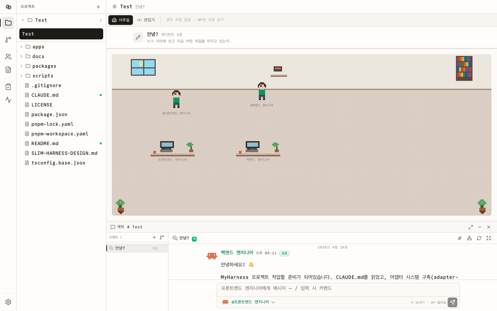
</picture>

[**Quickstart**](#quickstart) · [**Adapters**](#-bring-your-own-cli) · [**Architecture**](#whats-under-the-hood) · [**FAQ**](#faq)

[](#-license) [](#requirements) [](#)

## What is loom?

### A workspace where your CLI coding agents share an office.

**Claude Code is one terminal. loom is the room where five of them work together.**

loom is a Node.js server + React UI that runs your CLI coding agents (Claude Code, Gemini, Codex, OpenCode) inside one workspace, threads their conversations like a group chat, watches every file they touch in real time, and lets you walk to your real IDE in one click when you actually need to read code.

It looks like a chat app and a tiny pixel office — but underneath it's git worktrees, session resume, cost ledgers, MCP tracing, and a dispatcher that keeps every agent's input explicit.

**One thread, many agents. One workspace, no babysitting.**

| Step | Example |
|------|---------|
| **01** | Hire your team: `@frontend`, `@backend`, `@reviewer` — each one a real CLI agent with its own model, prompt, and budget. |
| **02** | Start a thread: _"Migrate auth to NextAuth and write the tests."_ |
| **03** | Watch them work: characters walk to their desks, edit files, hand off to each other. You read the chat, hit `IDE` when you want to dive in. |

> **Coming soon: gemini / codex / opencode adapters** — same explicit-input contract, ~40 lines per adapter. Today's stable adapter is **claude-code**; the others are wired but live behind the registry.

### Works with

| Adapter | Command | Input mode | What it surfaces |
|---|---|---|---|
| **Claude Code** | `claude` | stdin (`--print -`) | session_id · tool_use · cost · MCP calls |
| **Gemini CLI** | `gemini` | stdin (non-TTY) | _adapter scaffolded_ |
| **Codex** | `codex exec` | last arg | _adapter scaffolded_ |
| **OpenCode** | `opencode run` | last arg | _adapter scaffolded_ |

_If it speaks stdout one event at a time, it can move into the office._

---

## loom is right for you if

- ✅ You have **three Claude Code terminals open** for the same repo and lose track of which one did what
- ✅ You want **one chat thread** where `@backend` writes the migration and `@frontend` writes the form, and you can read both like Slack
- ✅ You want to see **every file each agent edits, in real time**, and the diff for "what did *that* run change?"
- ✅ You want to **read code in your real IDE** (VS Code / Cursor / Antigravity / Zed / IntelliJ) — not in another web Monaco
- ✅ You want **session resume**, **per-thread git worktrees**, and **cost per run** without writing those plumbing yourself
- ✅ You want a coding-agent runner that **never silently appends a system prompt to your message**

---

## Features

### 💬 Group chat for agents

Threads are first-class. Inside a thread, mention any agent with `@`, hand off mid-message, quote their answer in your reply, and read the result like a group DM. Reply quotes are exact strings, not summaries.

### 🏢 Pixel office (yes, really)

The "Office" view is a tiny diorama. Each agent walks around when idle, sits at their desk when a run starts, and a speech bubble shows the file they're editing or the tool they're using right now. Click a character → talk to them. It's a glanceable status board you can leave open all day.

<picture>
  <source media="(prefers-color-scheme: dark)" srcset="docs/assets/dark-office.png">
  
</picture>

### 📂 Live file presence

The file tree dots brighten the moment an agent opens a file. The tab bar shows `@backend` editing `auth.ts:42` while you're still typing. When the run finishes, the dot persists — the file remembers which run touched it. Click the dot, jump to that conversation.

### 🔧 Tool & MCP visibility

We parse the CLI's `tool_use` stream live. Read / Edit / Write / Bash / Grep / WebFetch all show up as chips on the agent's desk; `mcp__server__method` calls are grouped into "MCP servers in use" pills. No more guessing what the agent is _actually_ doing.

### 🌿 Worktree-isolated threads

Mark a thread "isolated" → loom creates a fresh `git worktree` for it, agents `cd` into that worktree on every run, and deletion cleans up. Run two threads against the same repo without their edits stepping on each other.

### 💰 Honest cost

Cost shown is whatever the CLI itself reported — claude-code's `total_cost_usd`, nothing more. We don't fabricate token estimates. Per-run number on each message, per-thread total in the bar, per-project sum on the projects screen.

### 🔁 Session resume

Every run captures the CLI's `session_id`. The next run in the same thread + agent automatically `--resume`s it, so the agent keeps context across turns. If a session id ever fails to resume (CLI says "no conversation found"), it gets poisoned — we never try it again.

### ✏️ Spec attachments

Markdown skills you write in `Specs`, attached only when *you* tick the paperclip on a message. Never auto-injected. Composed into the prompt as a bordered `=== Skill: <name> ===` block so the agent can tell where the user prompt ends.

### 🔌 Open in your real IDE

A button on every file (and every project card) opens it in **VS Code, Cursor, Antigravity, Zed, or IntelliJ** at the right line. Falls back through `code` on PATH → app-bundle absolute path → `open -a "<App>"` so it works without the user installing the shell command.

### 🎨 Theme-aware everything

Light, dark, and system. The pixel sprites, the office walls, the carpet, the monitors — all driven by CSS variables, so flipping theme flips the diorama too.

---

## Problems loom solves

| Without loom | With loom |
|---|---|
| ❌ Five terminals open, none of them know about the others. You manually paste context between them. | ✅ One thread, `@mention` to switch agents. Each one sees the same conversation. |
| ❌ "Did the agent finish?" requires alt-tabbing to a terminal and squinting at scrollback. | ✅ The Office view shows who's at their desk, and a speech bubble tells you the file they're editing right now. |
| ❌ "Which file did that last run change?" → `git diff` and pray. | ✅ Every run captures before/after git refs, persists `run_changes`, and the file tree pulses on the touched file even after the run is gone. |
| ❌ Each CLI prints its own log format. Cost numbers are scattered. | ✅ One SSE stream, one parser per adapter. Cost is whatever the CLI reports — captured, summed, displayed. |
| ❌ Two agents editing the same repo race each other and clobber each other's work. | ✅ Mark a thread "isolated" → its own git worktree. Two threads can be making conflicting edits at once. |
| ❌ Reading code in a webapp's Monaco while your real editor sits open in the next window. | ✅ One click sends the file (and the line number) to VS Code / Cursor / Antigravity / Zed / IntelliJ. |
| ❌ The web tool secretly prepends a system prompt and 40k of "helpful context" to every message. | ✅ The CLI gets exactly: your text + any spec you ticked. Nothing else. Ever. |

---

## Why loom is special

loom solves the _quiet_ orchestration problems honestly.

**Explicit input.**
The contract is: _user prompt + user-attached specs → CLI stdin/argv._ No system prompt injection, no AGENTS.md auto-discovery, no skill bundles. Predictable cost, predictable behavior, no "why did it suddenly know about my .env?"

**Live tool extraction.**
The adapter parses `tool_use` events out of stream-json without buffering the whole run. The Office desks update inside ~1 second of an agent picking up a tool. MCP calls (`mcp__server__method`) are split into `(server, method)` so we can show "github" / "context7" pills next to each desk.

**Poison-aware session resume.**
A failed `--resume <id>` poisons that session id permanently. The thread keeps moving forward instead of looping on a dead session — no more "No conversation found" infinite retries.

**Worktree-as-thread.**
Isolated threads create dangling git worktrees that agents `cd` into. Cleaned up on thread deletion. The branch lives until you merge it; before/after refs survive `git gc` because we persist `run_changes` rows.

**One spawn-process abstraction.**
`@loom/adapter-utils` exports `defineCliAdapter()` and `spawnProcess()`. A new adapter is ~40 lines: build the command, pick stdin or argv, plug it in. No frameworks, no plugin marketplace, no DI container.

**Pixel office is data, not chrome.**
Every animation in the Office reflects real state — speech bubbles read `activeTools.recent`, the screen pulse is `working === true`, the desk an agent walks to is its assigned slot. Nothing is decorative.

---

## What's Under the Hood

```
┌──────────────────────────────────────────────────────────────────┐
│                         LOOM SERVER (Hono)                       │
│                                                                  │
│  ┌────────────┐  ┌────────────┐  ┌────────────┐  ┌────────────┐  │
│  │  Projects  │  │   Threads  │  │    Runs    │  │  Adapters  │  │
│  │   + env    │  │ + worktree │  │ + sessions │  │   + cost   │  │
│  └────────────┘  └────────────┘  └────────────┘  └────────────┘  │
│                                                                  │
│  ┌────────────┐  ┌────────────┐  ┌────────────┐  ┌────────────┐  │
│  │ Active     │  │ Active     │  │ Run        │  │ Git        │  │
│  │ touches    │  │ tools      │  │ changes    │  │ snapshots  │  │
│  │ (in-mem)   │  │ (in-mem)   │  │ (sqlite)   │  │ (refs)     │  │
│  └────────────┘  └────────────┘  └────────────┘  └────────────┘  │
│                                                                  │
│  ┌────────────┐  ┌────────────┐  ┌────────────┐  ┌────────────┐  │
│  │   Specs    │  │  Open-in-  │  │  Log SSE   │  │   Health   │  │
│  │ (markdown) │  │  IDE relay │  │  per run   │  │  / probes  │  │
│  └────────────┘  └────────────┘  └────────────┘  └────────────┘  │
└──────────────────────────────────────────────────────────────────┘
                              ▲
       ┌──────────────────────┼──────────────────────┐
       │            stream-json / pty                │
   ┌───┴───┐    ┌────────┐   ┌───────┐   ┌──────────┐
   │claude │    │ gemini │   │ codex │   │ opencode │   ← any new
   │ code  │    │   CLI  │   │  exec │   │   run    │      stdin/argv CLI
   └───────┘    └────────┘   └───────┘   └──────────┘     in ~40 LOC
```

### The systems

**Projects** — Path on disk + per-project env vars (lower priority than agent env, higher than OS) + a chosen IDE for the "Open" button. Many projects, one server.

**Threads** — First-class conversation containers. Status (active/done/archived), curated context bundle, optional isolated git worktree, hand-off chain. The `ThreadList` sidebar inside the chat dock is your terminal-tab equivalent.

**Runs** — Every CLI invocation is a row. Status, exit code, prompt, attached spec ids, before/after git refs, cost, captured session id, the session id that was attempted to resume. The full audit trail of what each agent did.

**Adapters** — Each CLI is a thin module: `buildCommand()` → `{command, args}`, `spawn()` via the shared `spawnProcess`, optional `extractSessionId` / `extractTouchedEdits` / `extractToolUses`. Registered in `apps/server/src/adapters/registry.ts`. New ones drop in.

**Active touches & tools** — In-memory, drained when the run finishes. Powers the live "@backend is editing auth.ts" pulses, the Office speech bubbles, and the MCP-server pills.

**Run changes & git snapshots** — Before/after work-tree snapshots (dangling commits) → diff stat → persisted `run_changes` rows. Survives `git gc`. Powers the file-history rail and the per-run diff view.

**Specs** — Markdown documents you can attach to a message. Composed into the prompt as `=== Skill: <name> ===` blocks. Never auto-injected.

**Open-in-IDE** — Spawn relay: PATH lookup → app-bundle absolute paths → `open -a "<App Name>"` fallback (macOS). Returns 404 with the candidate list when nothing is found.

**Log SSE** — One stream per run, `text/event-stream`, replay-from-disk on reconnect. The chat panel renders parsed events; the live tail keeps streaming.

---

## What loom is not

**Not a Claude Code wrapper.**
loom doesn't bundle any agent. You bring your own CLI binaries — claude, gemini, codex, opencode, or anything else that takes a prompt on stdin and prints stdout.

**Not an autonomous agent.**
loom never decides to call another agent. Every hand-off is a button press. Every spec attachment is a checkbox tick. The user is in the loop, on purpose.

**Not a prompt manager.**
We don't compose system prompts, choose models for you, or maintain a "skill marketplace." Models live in `agent.adapterConfig.model`. Prompts live in `agent.prompt`.

**Not a code editor replacement.**
Monaco lives in the Editor view for diff inspection, but the "Open in IDE" button is the primary path for actual editing. We treat the user's real IDE as a first-class destination, not a fallback.

**Not multi-tenant.**
Local single-user tool. SQLite, no auth, no team accounts. If you put it on a public IP, it will execute arbitrary commands as you.

**Not a workflow builder.**
No DAG, no nodes, no canvas. Just threads, runs, agents, and the messages between them.

---

## Screens

### Office — the pixel diorama

<table>
  <tr>
    <td width="50%"></td>
    <td width="50%">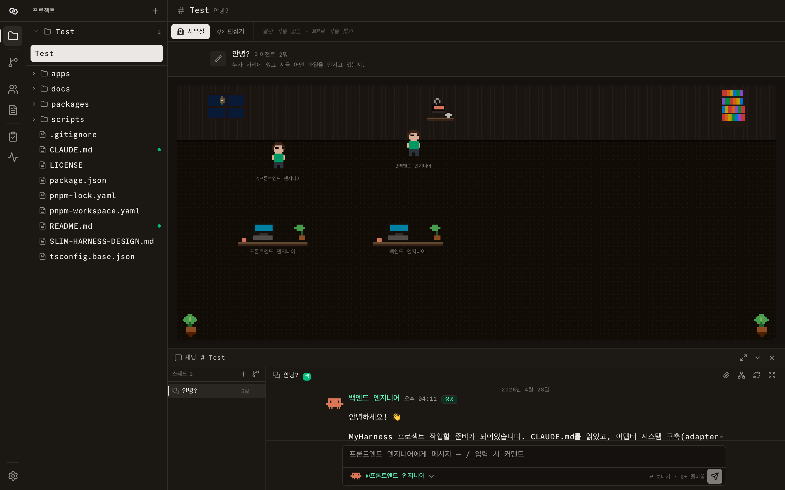</td>
  </tr>
</table>

Characters wander the corridor when idle, walk to their desks when a run starts, and a speech bubble names the file they're touching or the tool they're using. Window, coffee station, bookshelf, plants — all SVG `<rect>` pixel art driven by CSS variables, so the room re-skins itself for light/dark.

### Editor — Monaco + diff

<table>
  <tr>
    <td width="50%">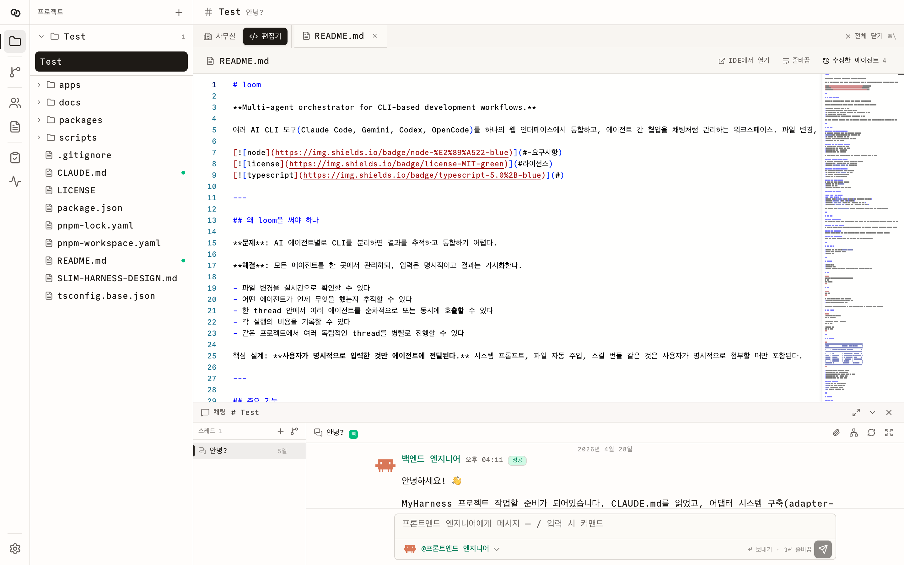</td>
    <td width="50%">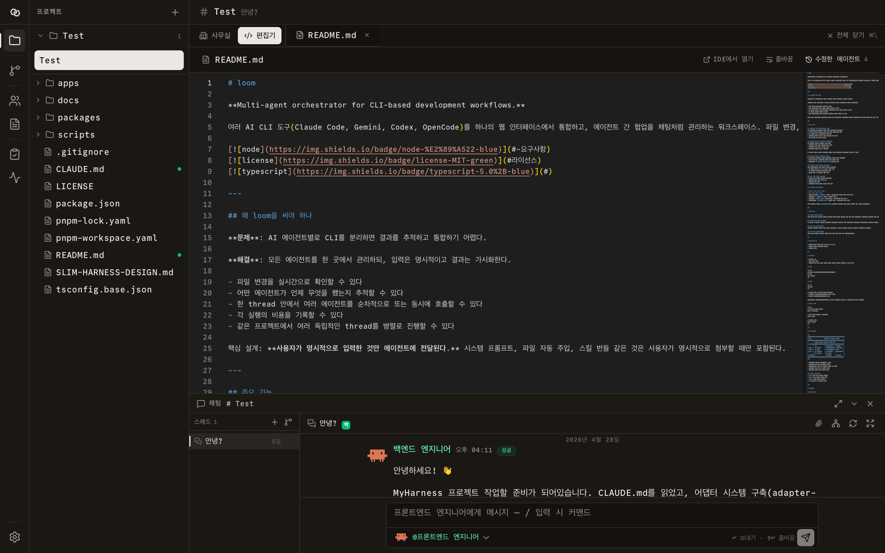</td>
  </tr>
</table>

The "Editor" tab swaps the diorama for a real file viewer with per-run diffs and a "history" rail showing which runs touched the file. The `Open in IDE` button on the toolbar sends the current file (and active line) to your real editor.

### Projects — many repos, one IDE picker

<table>
  <tr>
    <td width="50%">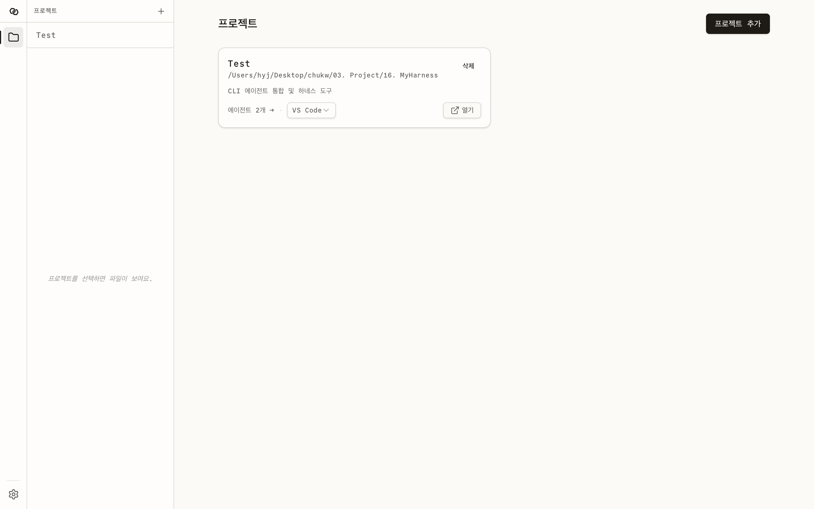</td>
    <td width="50%">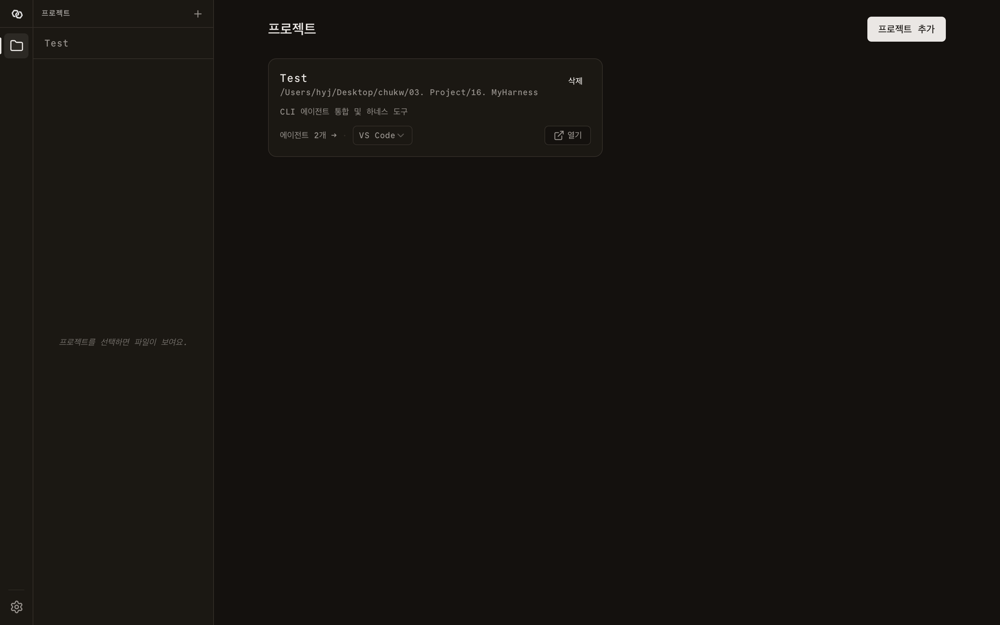</td>
  </tr>
</table>

Each card shows agent count and a per-project preferred IDE (VS Code / Cursor / Antigravity / Zed / IntelliJ). The "Open" button works whether or not the IDE's CLI is on your PATH.

### Agents — small org chart per project

<table>
  <tr>
    <td width="50%">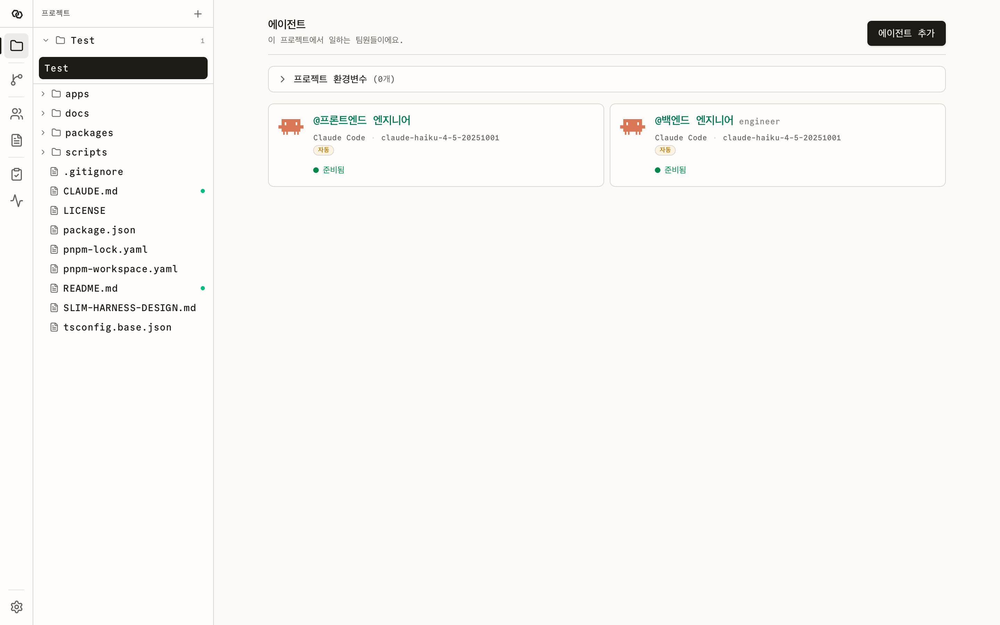</td>
    <td width="50%">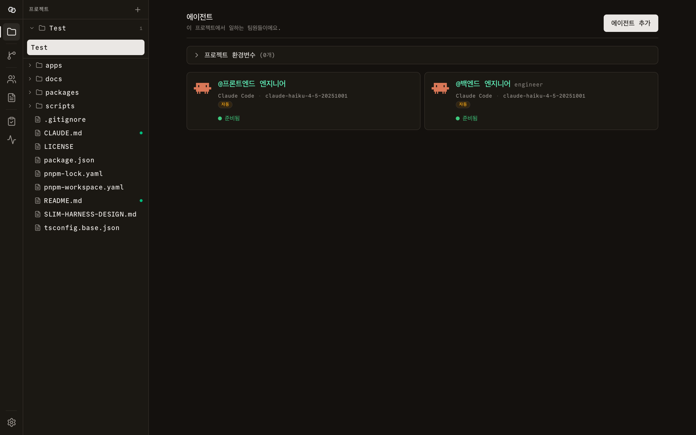</td>
  </tr>
</table>

Each agent has a name, role, color, adapter kind, model, custom prompt, and optional autonomy. The card shows assigned skills + per-project env editor for shared API keys.

### Skills — markdown you opt into

<table>
  <tr>
    <td width="50%">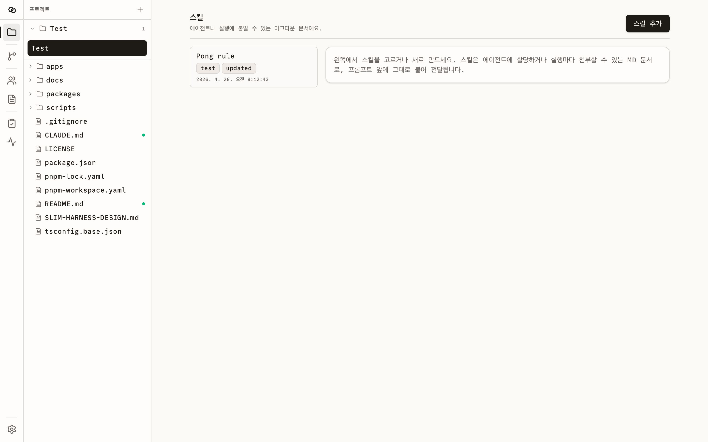</td>
    <td width="50%">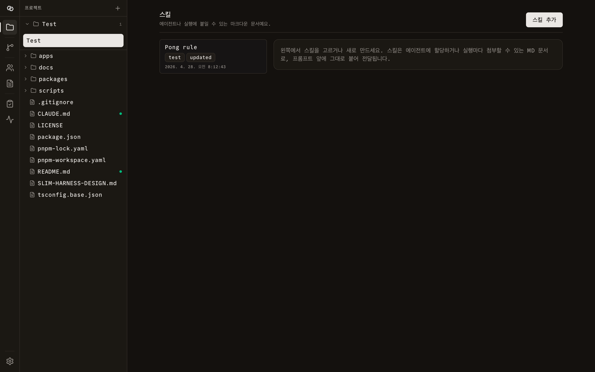</td>
  </tr>
</table>

Skills are plain markdown files. Tick the paperclip on a message to attach one — never auto-injected, never surprise context.

### History — every run, ever

<table>
  <tr>
    <td width="50%">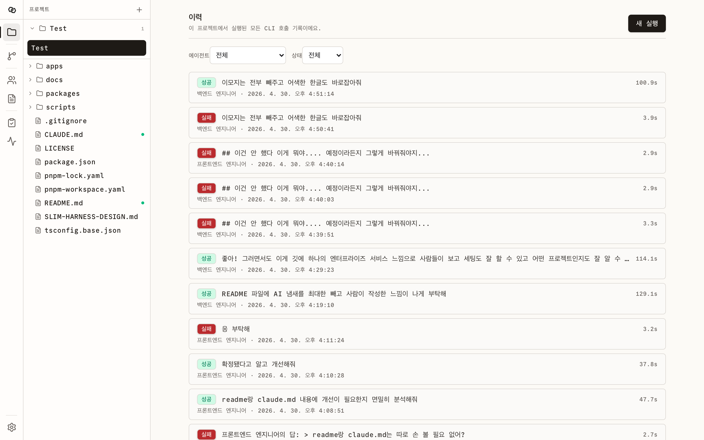</td>
    <td width="50%">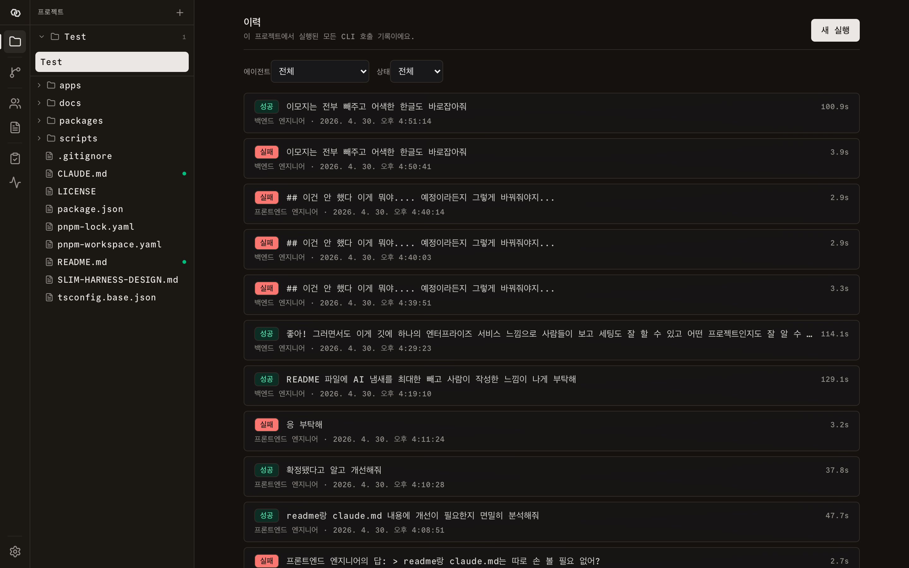</td>
  </tr>
</table>

Filter by agent / status / thread. Each row links to the run page (full log + diff) and the original chat message.

---

## Quickstart

Self-hosted, single-binary-feel. Local dev only — no auth, no cloud.

### Requirements

- **Node.js ≥ 22**
- **pnpm ≥ 9**
- At least one supported CLI installed and on PATH: `claude`, `gemini`, `codex`, or `opencode`

### Run

```bash
git clone https://github.com/Chu5491/loom.git
cd loom
pnpm install
pnpm dev
```

This boots two processes:

- **Server** at `http://localhost:3200` — REST + SSE
- **Web** at `http://localhost:3201` — open this in your browser

Create a project pointing to a repo on disk, add an agent (paste your CLI command name), and send a message in a thread.

### Verify the build

```bash
pnpm -r typecheck      # all packages
pnpm -r test           # vitest (server + each adapter)
pnpm --filter @loom/web build
```

---

## FAQ

**Do I need to run anything besides `pnpm dev`?**
No. SQLite is created on first boot at `~/.loom/loom.db`. Logs land in `~/.loom/logs/`. Worktrees in `~/.loom/worktrees/`. There is no separate Postgres or Redis.

**Why no auto-injected system prompt?**
Predictable cost, predictable behavior, predictable surface area for security review. If you want a system prompt, write it as a Spec and attach it. The CLI sees what you typed plus what you ticked — nothing else.

**Can multiple agents work in the same thread at once?**
Yes. Each `@mention` spawns a new run, each run streams in real time. The Office view shows them all sitting at their desks simultaneously.

**What if my IDE isn't on PATH?**
The "Open" button tries: PATH command (`code`, `cursor`, `zed`, ...) → app-bundle absolute path (`/Applications/Visual Studio Code.app/Contents/Resources/app/bin/code`) → macOS `open -a "<App>"`. The vast majority of macOS users hit case 2 or 3 without ever installing a shell command.

**How do I add a new CLI adapter?**
Copy `packages/adapters/claude-code/`, change `kind` and `buildCommand`, register in `apps/server/src/adapters/registry.ts`. ~40 lines. See [`CLAUDE.md §4`](./CLAUDE.md) for the contract.

**What's an "isolated" thread?**
A thread with its own git worktree. Agents `cd` into the worktree on every run. Lets two threads make conflicting edits in parallel without colliding. Toggle when creating the thread.

**Will it run on Windows?**
The server uses POSIX path conventions and macOS-favored fallbacks for the IDE relay. Linux works. Windows: stdin spawn should work, but the `open -a` fallback won't and we haven't tested it.

---

## Development

```bash
pnpm dev                         # full stack (server :3200 + web :3201, watch)
pnpm dev:server                  # server only
pnpm --filter @loom/web dev      # web only
pnpm -r typecheck                # all packages
pnpm -r test                     # all unit tests (vitest)
pnpm --filter @loom/server test  # server tests only
pnpm -r build                    # production build
```

### Folder layout

```
loom/
├── apps/
│   ├── server/        Hono API + SQLite + run executor + git snapshots
│   └── web/           React SPA + Vite + TanStack Query + Tailwind v4
└── packages/
    ├── core/                      Shared types (Project, Run, Thread, …)
    ├── adapter-utils/             defineCliAdapter() + spawnProcess()
    └── adapters/
        ├── claude-code/           stable
        ├── gemini/                scaffolded
        ├── codex/                 scaffolded
        └── opencode/              scaffolded
```

See [`CLAUDE.md`](./CLAUDE.md) for the working agreement (naming, comments, abstraction rules) and [`SLIM-HARNESS-DESIGN.md`](./SLIM-HARNESS-DESIGN.md) for the original design intent.

---

## 🔌 Bring Your Own CLI

A new adapter is one file. Here's the entire `claude-code` adapter, abridged:

```ts
import { defineCliAdapter } from "@loom/adapter-utils";

export const claudeCodeAdapter = defineCliAdapter({
  kind: "claude-code",
  buildCommand: (cfg) => ({
    command: cfg.command ?? "claude",
    args: ["--print", "-", "--output-format", "stream-json", "--verbose",
           ...(cfg.model ? ["--model", cfg.model] : []),
           ...(cfg.extraArgs ?? [])],
  }),
  prompt: { via: "stdin" },
  applyResume: (args, sessionId) => ["--resume", sessionId, ...args],
  extractSessionId: extractClaudeSessionId,
  extractTouchedEdits: extractClaudeTouchedEdits,
  extractToolUses: extractClaudeToolUses,
});
```

Register it:

```ts
// apps/server/src/adapters/registry.ts
import { claudeCodeAdapter } from "@loom/adapter-claude-code";
import { yourAdapter } from "@loom/adapter-yours";

export const adapters: Record<string, CliAdapter> = {
  "claude-code": claudeCodeAdapter,
  "yours":       yourAdapter,
};
```

That's the contract. **The CLI gets stdin/argv + signals. The web gets stdout chunks + parsed events. Nothing else flows through.**

---

## Roadmap

- ✅ Live file presence + active touches
- ✅ Pixel office with character state machine + speech bubbles
- ✅ Open-in-IDE relay (vscode / cursor / antigravity / zed / intellij)
- ✅ Per-project env vars + per-thread isolated worktrees
- ✅ Cost capture per run, summed per thread
- ✅ Session resume with poison-on-failure
- ✅ Tool & MCP extraction from stream-json
- ⚪ gemini / codex / opencode adapters wired into the registry
- ⚪ Run logs replay search (full-text)
- ⚪ Diff-driven PR creation
- ⚪ Agent-to-agent suggestion patterns (`[NEXT]` / `[ASK]`)
- ⚪ Importable project templates (agents + skills + env)

---

## License

MIT © 2026 — for people who want to read code in their real editor.
